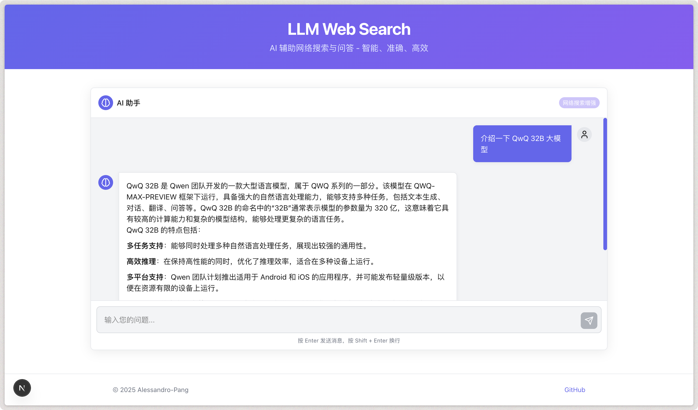

<div align="center">

<h1>LLM Web Search</h1>

**AI 辅助网络搜索与问答 - 智能、准确、高效**

[](https://github.com/Alessandro-Pang/ollama-web-search/blob/main/LICENSE)
[](https://nextjs.org/)
[](https://www.typescriptlang.org/)

</div>

## 📝 项目介绍

LLM Web Search 是一个结合大语言模型与网络搜索功能的智能问答应用，通过整合 LLM 模型与 Google 搜索功能，实现了高效、准确的网络信息检索与智能回答。项目采用现代化的蓝紫色主题设计，提供了简洁优雅的用户界面，支持 Markdown 渲染，适配深色/浅色模式。

## ✨ 特性

- 🔍 **智能搜索**：结合 SearXNG 搜索 API 获取最新网络信息
- 🧠 **LLM 支持**：支持多种大语言模型，如 OpenAI、DeepSeek、Ollama 等
- 🌐 **网页抓取**：智能抓取搜索结果页面内容，提供更全面的信息
- 💬 **优雅界面**：现代化的蓝紫色主题设计，支持深色/浅色模式
- ✏️ **Markdown 支持**：回答内容支持 Markdown 格式，提供更好的阅读体验
- 🔄 **实时反馈**：输入框自动调整大小，提供打字动画和加载状态

## 🛠️ 技术栈

- **前端**：Next.js 14, TypeScript, React
- **UI**：自定义 CSS 变量, Markdown-it
- **AI**：AI SDK, Ollama API
- **搜索**：SearXNG 搜索 API
- **数据存储**：ChromaDB (向量数据库)

## 🚀 快速开始

### 前置要求

1. 安装 [Ollama](https://ollama.com/)： [Ollama 部署本地大模型与使用](https://juejin.cn/post/7457812218509377587)
2. 安装 [ChromaDB](https://www.trychroma.com/)： [ChromaDB 安装与使用参考文章](https://juejin.cn/post/7480401080742248474)
3. 安装 [SearXNG](https://searxng.org)： [SearXNG 安装与使用参考文章](https://juejin.cn/post/7480089438899404850)

> 注：如果不是用本地 Ollama 模型，可以不安装 Ollama

### 安装与运行

1. 克隆项目

```bash
git clone https://github.com/Alessandro-Pang/ollama-web-search
cd ollama-web-search
```

2. 安装依赖

```bash
pnpm install
# 或
npm install
# 或
yarn install
```

3. 配置环境变量

创建 `.env.local` 文件并添加以下内容：

```conf
AI_PROVIDER_TYPE = "AI 类型，目前支持 ollama、deepseek、openai"
AI_PROVIDER_BASE_URL = "AI 供应商的 API URL"
AI_PROVIDER_API_KEY = "AI 供应商的 API Key"
AI_MODEL_NAME = "AI 模型名称"

CHROMADB_PATH = "ChromaDB 的地址"
SEARXNG_API_URL = "SearXNG API 地址"
```

4. 启动开发服务器

```bash
pnpm dev
# 或
npm run dev
# 或
yarn dev
```

5. 打开浏览器访问 [http://localhost:3000](http://localhost:3000)

## 📷 界面预览



## 📚 使用指南

1. 在输入框中输入您的问题
2. 系统会自动搜索相关网页内容
3. LLM 模型会分析搜索结果并生成回答
4. 回答将以 Markdown 格式呈现，支持代码块、列表等格式

## 🤝 贡献

欢迎提交 Issues 和 Pull Requests 来帮助改进项目！

## 📄 许可证

[MIT License](LICENSE)

## 🙏 致谢

- [Next.js](https://nextjs.org/) - React 框架
- [Ollama](https://ollama.com/) - 本地大语言模型运行工具
- [ChromaDB](https://www.trychroma.com/) - 开源向量数据库
- [SearXNG](https://searxng.org) - 网络搜索引擎

---

© 2025 [Alessandro-Pang](https://github.com/Alessandro-Pang)
